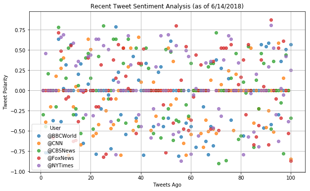
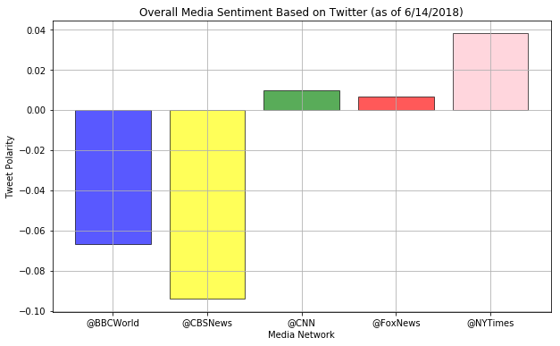

# News Mood

* Most tweets tend to actually have a neutral sentiment, with majority of the plot lines being roughly around the middle in the first graph  in the recent tweet sentiment analysis graph.
* New York Times has the highest overall sentiment of its past 100 tweets, while CBS and BBC has the worst, but it tends to slightly lean to the negative amongst the mean of all tweets.
* Throughout working with this project, there was high volatility of the overall media sentiment depending on the day, as certain days have more negative tweets, and other days all media might be positive across the board.


```python
# Importing dependencies
import tweepy
import json
import pandas as pd
import matplotlib.pyplot as plt

from config import consumer_key, consumer_secret, access_token, access_token_secret
from vaderSentiment.vaderSentiment import SentimentIntensityAnalyzer
```


```python
# Setting up Tweepy Authentication
auth = tweepy.OAuthHandler(consumer_key, consumer_secret)
auth.set_access_token(access_token, access_token_secret)
api = tweepy.API(auth, parser=tweepy.parsers.JSONParser())

# Creating the analyzer as well as the targets
analyzer = SentimentIntensityAnalyzer()
targets = ['@BBCWorld', '@CNN', '@CBSNews', '@FoxNews', '@NYTimes']

# Creating an empty list to store each tweet dictionary
tweets = []

# Browsing through each target and appending each of their first 100 tweets
for user in targets:
    counter = 1
    public_tweets = api.user_timeline(user, count = 100)
    for tweet in public_tweets:
        tweets.append({
            "User" : user,
            "Date" : tweet['created_at'],
            "Compound Score" : analyzer.polarity_scores(tweet['text'])["compound"],
            "Positive Score" : analyzer.polarity_scores(tweet['text'])["pos"], 
            "Neutral Score" : analyzer.polarity_scores(tweet['text'])["neu"],
            "Negative Score" : analyzer.polarity_scores(tweet['text'])["neg"],       
            "Text" : tweet['text'],
            "Tweets Ago": counter,
        })
        counter += 1

# Initializing the DataFrame from the tweets list
tweets_df = pd.DataFrame.from_dict(tweets)
tweets_df.to_csv("tweets")
tweets_df.head()
```


<div>
<style scoped>
    .dataframe tbody tr th:only-of-type {
        vertical-align: middle;
    }

    .dataframe tbody tr th {
        vertical-align: top;
    }

    .dataframe thead th {
        text-align: right;
    }
</style>
<table border="1" class="dataframe">
  <thead>
    <tr style="text-align: right;">
      <th></th>
      <th>Compound Score</th>
      <th>Date</th>
      <th>Negative Score</th>
      <th>Neutral Score</th>
      <th>Positive Score</th>
      <th>Text</th>
      <th>Tweets Ago</th>
      <th>User</th>
    </tr>
  </thead>
  <tbody>
    <tr>
      <th>0</th>
      <td>0.0000</td>
      <td>Thu Jun 14 23:05:04 +0000 2018</td>
      <td>0.000</td>
      <td>1.000</td>
      <td>0.000</td>
      <td>Boris Becker claims diplomatic immunity in ban...</td>
      <td>1</td>
      <td>@BBCWorld</td>
    </tr>
    <tr>
      <th>1</th>
      <td>-0.7650</td>
      <td>Thu Jun 14 22:26:37 +0000 2018</td>
      <td>0.452</td>
      <td>0.548</td>
      <td>0.000</td>
      <td>Banksy print stolen from Toronto exhibit by br...</td>
      <td>2</td>
      <td>@BBCWorld</td>
    </tr>
    <tr>
      <th>2</th>
      <td>-0.7650</td>
      <td>Thu Jun 14 22:23:52 +0000 2018</td>
      <td>0.423</td>
      <td>0.577</td>
      <td>0.000</td>
      <td>Turkey election: Three dead in clash as pre-po...</td>
      <td>3</td>
      <td>@BBCWorld</td>
    </tr>
    <tr>
      <th>3</th>
      <td>0.0000</td>
      <td>Thu Jun 14 21:54:22 +0000 2018</td>
      <td>0.000</td>
      <td>1.000</td>
      <td>0.000</td>
      <td>Ex-Walmart now a shelter for child migrants ht...</td>
      <td>4</td>
      <td>@BBCWorld</td>
    </tr>
    <tr>
      <th>4</th>
      <td>-0.3716</td>
      <td>Thu Jun 14 21:01:51 +0000 2018</td>
      <td>0.220</td>
      <td>0.653</td>
      <td>0.128</td>
      <td>They survived the Ice Age but today saiga ante...</td>
      <td>5</td>
      <td>@BBCWorld</td>
    </tr>
  </tbody>
</table>
</div>


```python
# Creating the scatterplot per target, which automatically changes colors
plt.figure(figsize=(10,6))
for target in targets:
    specific = tweets_df.loc[tweets_df["User"] == target]
    plt.scatter(specific['Tweets Ago'], specific['Compound Score'], alpha=0.75, label = target)

# Creating the labels and tweets for the scatterplot
plt.title("Recent Tweet Sentiment Analysis (as of 6/14/2018)")
plt.xlabel("Tweets Ago")
plt.ylabel("Tweet Polarity")

# Adding the grid, legend, and saving it into a graph
plt.legend(title="User")
plt.savefig("RecentAnalysis")
plt.grid()
```





```python
# Grouping by media and mean in order to grab overall sentiment
new_df = tweets_df.groupby('User')
test = pd.DataFrame(new_df['Compound Score'].mean())

# Plotting each bar graph per media target
plt.figure(figsize=(10,6))
plt.bar([target for target in targets], test['Compound Score'], color=['blue', 'green', 'yellow', 'red', 'pink'], alpha=0.65,\
        edgecolor='black')

# Creating the title and labels, and saving it into a picture
plt.title("Overall Media Sentiment Based on Twitter (as of 6/14/2018)")
plt.xlabel("Media Network")
plt.ylabel("Tweet Polarity")
plt.savefig("OverallSentiment")
plt.grid()
```




